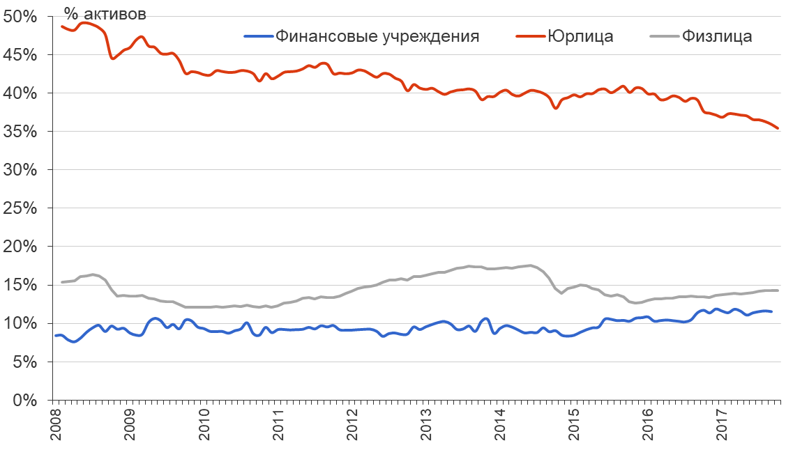
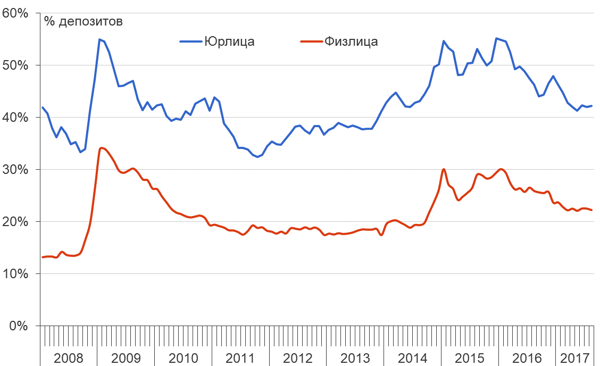

## Цели лекции 

+ Понять суть банковского бизнеса
+ Понять, каким образом банки привлекают финансирование и как его используют 
+ Изучить особенности обязательств банков и принципы управления активами 
+ Изучить источники рисков, с которыми сталкиваются банки
+ Понять особенности банковской системы РФ 
+ Проанализировать основные причины банковского кризиса в 2017 году 

## Финансовое посредничество 

+ Финансовые институты выступают **посредниками** между сберегающими и кредитующимися агентами, поэтому их активами и обязательствами являются различные финансовые инструменты
+ Финансовые институты объединяют фонды множества людей и фирм с тем, чтобы обеспечить их более эффективное использование 
+ Уровень финансового развития и уровень экономического развития связаны между собой -- нет развитых экономик с неразвитым финансовым сектором. Но причинно-следственная связь "работает" в обе стороны. 

##  Банки 

Банки занимают особую роль в финансовой системе по следующим причинам: 

+ Банки обеспечивают большую часть **внешнего финансирования** компаний, особенности, в развивающихся экономиках. 
+ Банки, в отличие от других финансовых учреждений, имеют отличительный источник финансирования -- **депозиты** (depository institutions). Обычно депозиты -- до определенной суммы - страхуются государством. 
+ Банковский бизнес -- одним из наиболее **регулируемых** видов финансовой деятельности. Почему? 
   
## Экономические функции финансовых учреждений (банков)   

+ **Объединение** ресурсов множества мелких сберегающих агентов 
+ обеспечение расчетных и **платежных** функций 
+ Обеспечение возможностей для **диверсификации** риска
+ Сбор и обработка информации таким образом, которые снижают **информационные издержки** 

## Активы и пассивы "стандартного" банка

+ Обязательства банка -- источники средств, активы банка -- вложения средств
+ **Активы = Обязательства + Капитал**. Капитал банка представляет собой стоимость для его акционеров.  
+ Банки получают и предоставляют средства на платной основе (процентная ставка).
+ Прибыль банка образуется за счет разницы между процентной ставкой по привлеченным ресурсам и вложенным - **net interest margin (NIM)**.
+ Активы и пассивы банков имеют разную "длину". То есть банки предоставляют ресурсы "в среднем" на более длинный срок, чем привлекают ресурсы. 

## Активы банков 

+ Денежные средства
+ Счета в Банке России и корсчета в других банках
+ Кредиты корпоративному сектору -- на текущие нужды (к примеру, пополнение оборотного капитала) и инвестиционные цели (к примеру, строительство завода или торгового центра)
+ Кредиты населению -- потребительские или ипотечные 
+ Кредиты другим финансовым учреждениям
+ Вложения в долговые бумаги (облигации)
+ Вложения в долевые бумаги (акции)

## Активы банковской системы России

в трлн рублей 

  

## Активы банков -- денежные средства

Ликвидные активы банков можно разделить на следующие группы: 

+ Касса
+ Обязательные резервы (фактически -- средства в центральном банке)
+ Средства в расчетах
+ Корсчета -- средства, которые банки держат в других банках

## Ликвидные активы российской банковской системы

  

## Активы банков -- кредиты 

+ Кредиты нефинансовому сектору  -- обычно залоговые
+ Кредиты физическим лицам - залоговые (ипотека) и беззалоговые (потребительские кредиты)
+ Межбанковские кредиты 
+ Прочие кредиты, включая репо 

Банки могут специализироваться по основным типам кредитов (универсальные, розничные, ипотечные и прочие). 
Просроченная задолженность -- не погашенная в срок задолженность по основному долгу и/или плановым процентам. 

## Кредиты российской банковской системы по типам 

  

## Доля просроченной задолженности (NPL) по типам кредитов

  

## Пассивы банков 

+ Депозиты нефинансовых компаний
+ Депозиты населения
+ Депозиты других финансовых учреждений (межбанковский рынок кредитования)
+ Выпущенные облигации 
+ Векселя 
+ Резервы на возможные потери 
+ Капитал банка

## Основные источники фондирования банковской системы России

  

## "Валютизация" депозитов

Доля депозитов в иностранной валюте по типу

  

## Процентные ставки банков и оценка чистой процентной маржи (NIM)

  

## Капитал банка

+ **Капитал банка = Активы банка - Обязательства банка**
+ Капитал банка - это средства акционеров, вложенные в банка, и одновременно "подушка безопасности" против снижения стоимости активов, которая может привести к неплатежеспособности банка (обязательства > активы). 
+ Банки обязаны выполнять требования по **достаточности капитала** (норматив Н1). Минимальное значение с 1 января 2016 года -- 8% (ранее 10%)
+ Определяется как отношение как активов, взвешенных по уровню риска (risk weighted assets -- RWA) к капиталу
+ Точную формулу расчета и поправочные коэффициенты можно посмотреть в инструкции Банка России 139-И. Нормативы по большинству банков доступны на сайте ЦБ в 135 форме отчетности кредитных организаций.

## Норматив Н1.0 для топ-10 российских банков 

по состоянию на 01.02.2016

  

##  Резервы на возможные потери по ссудам (РВПС)

+ Важная часть капитала -- **резервы на возможные потери по ссудам**
+ РВПС начисляются для того, чтобы покрыть потенциальные убытки от невозврата кредита и дефолта -- связь с просроченной задолженностью!
+ Формирование резервов позволяет обеспечивать более стабильные условия деятельности и избегать сильных колебаний величины прибыли 
+ Банк классифицирует ссуды и относит их в ту или иную категорию качества, исходя из оценки риска.

## Ставка риска по категории качества кредита

Определяется по Положению Банка России №254-П 

| Категория качества            | Наименование  | Размер расчетного резерва в процентах от суммы основного долга по ссуде |
|-------------------------------|---------------|-------------------------------------------------------------------------|
| I категория качества (высшая) | Стандартные   | 0%                                                                      |
| II категория качества         | Нестандартные | от 1% до 20%                                                            |
| III категория качества        | Сомнительные  | от 21% до 50%                                                           |
| IV категория качества         | Проблемные    | от 51% до 100%                                                          |
| V категория качества (низшая) | Безнадежные   | 100%                                                                    |

## Базовая деятельность банка

+ Трансформация активов
+ Управление обязательствами 
+ Maturity transformation -- банки всегда занимают "коротко"" и кредитуют "длинно".

## Общие принципы управления банком 

1. Управление ликвидностью 
2. Управление активами 
3. Управление размером капитала и его достаточностью 

## Рентабельнасть активов и капитала банка 

$$ ROA = \frac{прибыль}{активы} $$ 

$$ ROE = \frac{прибыль}{капитал} $$

$$ Leverage = \frac{активы}{капитал} $$ 

$$ ROE = ROA * Leverage $$ 

Из последнего уравнения следует, что при фиксированной доходности активов (ROA) прибыль для акционеров максимальна при **минимальном** размере капитала! 

## Риски банков

+ **Риск ликвидности** - риск того, что клиенты потребуют немедленно вернуть им наличные средства
+ **Кредитный риск** - риск того, что клиенты не вернут выданные кредиты. 
+ **Процентный риск** - риск того, что изменение процентных ставок окажет большее влияние на стоимость активов, чем на стоимость обязательств
+ **Валютный риск** - риск того, что изменение стоимости валюты окажет большее влияние на стоимость активов, чем на стоимость обязательств.  
**Торговый риск** - риск того, что трейдеры банка, осуществляя операции на рынках ценных бумаг, понесут убытки. 
+ Прочие риски

## Управление риском ликвидности 

+ риски на стороне обязательств -- риск внезапного возврата депозитов
+ риск на стороне активов -- кредитная линия
+ Даже если у банка есть избыточный капитал, он все равно подвержен риску ликвидности 

**Инструменты управления риском ликвидности:**

+ приведение в соответствие временной структуры активов и обязательств
+ формирование избыточных резервов 
+ продажа портфеля ценных бумаг 
+ продажа кредитного портфеля другому банку 
+ отказ клиенту в кредитовании 
+ обеспечение доступа к инструментам рефинансирования центрального банка 

## Управление кредитным риском 

Проблема **ассиметрии информации** -- потенциальные заемщики знают о своем финансовом положении больше, чем банк. 
Наиболее рискованные заемщики имеют наибольшие стимулы обратиться в банк за кредитом.

**Инструменты управления кредитным риском: **

+ Диверсификация кредитного портфеля по заемщикам, отраслям и проч.
+ Анализ и оценка финансового положения заемщиков (скрининг)
+ Мониторинг деятельности заемщиков (к примеру, обязательство по переводу всех расчетов в основной кредитующий банк)
+ Специализация банка 
+ Залоги 
+ Ковенанты

## Управление процентным риском

+ Процентные ставки в экономике меняются со временем
+ Стоимость различных активов и различных обязательств может по разному меняться при изменении процентных ставок, некоторые могут не меняться. 
+ Если банк имеет больше обязательств, "чувствительных" к изменению ставки, повышение ставок уменьшит прибыль банка, снижение ставок -- увеличит. 
+ Стратегия управления процентным риском зависит от понимания и прогноза по процентным ставкам. 

**Инструменты управления процентным риском:** 

+ модификация баланса с тем, чтобы снизить разницу между средней дюрацией активов и обязательств
+ производные финансовые инструменты по ставкам (обычно IRS -- interest rate swaps)

## Рыночный риск 

+ Обычно банки активно участвуют в операциях на рынке ценных бумаг и сами являются владельцами портфелей ценных бумаг. 
+ Риск того, что стоимость ценных бумаг может снизиться, называется **рыночным риском**
+ Обычно трейдеры получают бонусы при прибыли от операции, а убытки несет банк. Это также создает проблему moral hazard. 

**Инструменты управления рыночным риском: **

+ Оценка и мониторинг риска, который создают торговые операции трейдеров
+ Определение лимитов -- индивидуальных и общих -- на риск 
+ Чем более рискованный портфель держит банк, тем больше капитала ему надо иметь 

## Риски банков и необходимость регулирования
 
Банковская деятельность -- один из наиболее регулируемых видов деятельности из-за различных рисков и значимости финансовой системы для экономики в целом. Асимметрия информации (стороны обладают разным количеством информации) усиливает проблемы отрицательного отбора и moral hazard.  

Формы регулирования банковской деятельности: 

+ необходимость выполнения нормативов (наиболее важный - норматив достаточности капитала). Невыполнение нормативов является причиной для отзыва лицензии, то есть фактического закрытия банка. 
+ Государственная система страхования вкладов
+ Защита прав потребителей - требования о раскрытии информации об условиях (к примеру, эффективной процентной ставки по кредиту)

## Плюсы и минусы избыточного регулирования

Аргумент Коуза: 

Плюсы         | Минусы
------------- | -------------
Стабильность системы  | Издержки для банков 
Издержки мониторинга  | Снижение эффективности

## "Набег на банки""  

+ Набег на банки - классический пример о необходимости регулирования и наличия центрального банка. 
+ Избежание набегов на банки - одна из причин создания центральных банков для выполнения ими функции "кредитора последней инстанции"
+ Набеги на банки происходят до сих пор! 
+ Пример со Сбербанком в декабре 2014 года (массовая смс-рассылка клиентам банка о финансовых проблемах)

## Банковская система России - основные особенности 

+ Доминирование нескольких крупных государственных банков -- фактически сегментация банковского сектора на отдельные группы. Усиление "огосударствления" в 2017 году за счет национализации ряда крупных банков. 
+ Опора на депозиты в структуре банковского фондирования, низкая доля иных источников финансирования.
+ Значительная доля операций в иностранной валюте как в активной, так и в пассивной части баланса -- валютные риски для большинства банков 
+ Стратегия Банка России на сокращение количества банков и повышение их устойчивости при противоречивой имплементации регулирования

## Банковский кризис в 2017 году

+ В 2017 году ряд крупнейших банков (ФК Открытие, БИН-банк, Промсвязьбанк) были фактически национализированы ЦБ и переданы в Фонд консолидации банковского сектора (УК ФБКС). Отзыв лиценизий Татфондбанка и Югры (Топ-50). 
+ В топ-10 российских банков лишь два являются частными (Альфа-банк и МКБ).Государство прямо и косвенно контролирует примерно три четверти активов российского банковского сектора
+ По предварительным оценкам Банка России, сумма средств, необходимых для восстановления капитала банков до нормативного уровня может составить 800-820 миллиардов рублей. Однако прямые и косвенные издержки значительно больше.  

## Причины банковского кризиса в 2017 году 

+ Падение цен на нефть, девальвация рубля, обесценение залогов, снижение качества большинства заемщиков
+ Очистка банковского сектора и активный отзыв лицензий за нарушение нормативов. Ужесточение нормативов и практики их применения.
+ Жесткая денежно-кредитная политика, резкий рост стоимости фондирования
+ Крупнейшие группы --1 ) неорганический рост – санации как источник средств для роста и расчистки активов 2) Создание колец, использование НПФ и 
страховщиков для манипуляций рынком 3) манипуляции на долговом рынке 
+ Противоречивый регулятор -- отсутствие единой политики санации, постоянные реформы надзора

## Задания и вопросы - 1

1. Банки имеют высокую долю ликвидных активов на балансе -- по сравнению с другими бизнеса. Как вы думаете почему?
2. Почему может изменяться доля ликвидных активов? 
3. Какие инструменты управления пассивами может использовать банк, столкнувшийся с неожиданным оттоком депозитов. Почему банки предпочитают управлять пассивами, а не активами в этом случае? 
4. Банки А и Б имеют активы на 10 млрд рублей. Доходность активов одинаковая в обоих банков. Банк А имеет обязательства в 8 млрд рублей, банк Б -- на 9 млрд рублей. Акционером какого банка вы предпочли бы быть? Почему? 

## Задача - 1

У вас есть следующая информация о банках А и Б. Рассчитайте для каждого из этих банков показатели ROA, ROE и показатель левереджа.

Прибыль банка А = 1,8. Банка Б = 0,9

  

## Задача - 2 

У вас есть следующая информация о банках А и Б.Если резервные требования составляют 10% от суммы расчетных счетов и оба банка имеют одинаковый доступ к рефинансированию ЦБ, какой из двух банков имеет больший риск ликвидности? какой из них имеет больший риск банкротства?

  

